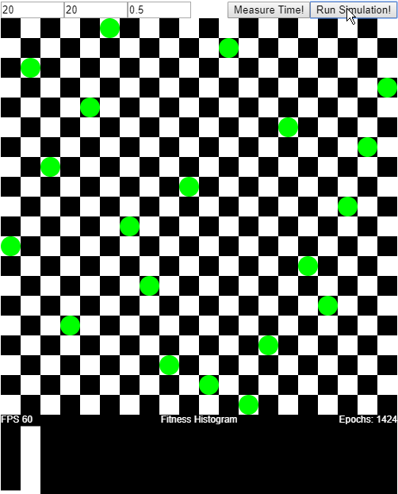

# Genetic N-Queens
Solve N-Queens problem using Genetic Algorithm, implemented in Javascript and animated using P5.js.
Available at https://italotabatinga.github.io/genetic-nqueens/

## Reference
- Sarkar U. and Nag S. An Adaptive Genetic Algorithm for Solving N-Queens Problem